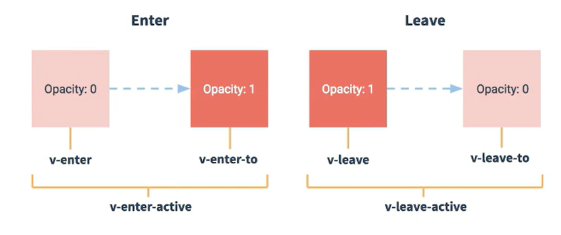

# vue_cli_test

## Project setup
```
npm install
```

### Compiles and hot-reloads for development
```
npm run serve
```

### Compiles and minifies for production
```
npm run build
```

### Lints and fixes files
```
npm run lint
```

### Customize configuration
See [Configuration Reference](https://cli.vuejs.org/config/).

## vue.config.js配置文件 
 - 使用 vue inspect > output.js 可以将默认配置输出到output.js文件中
 - 使用 vue.config.js 可以对脚手架进行个性化定制，例如关闭自动语法检查等，详见vue2官网

## ref 属性
 1. 被用来给元素或子组件注册引用信息（id的替代者）
 2. 应用在html标签上获取的是真实DOM元素，应用在组件标签上是组件实例对象（vc）
 3. 使用方式：
    打标识：`<h1 ref="xxx"> ... </h1>` 或 `<MySchool ref="xxx"></MySchool>`
    获取：this.$refs.xxx 

## props配置项

功能：让组件接收外部传过来的数据，步骤：
1. 传递数据：
    `<Demo name="xxx"/>`

    > **注意：** 项目中一般这样写：`<Demo :obj="xxx">` <br> 添加冒号后，引号中的内容就作为js表达式进行计算处理了，不再单纯作为字符串传递。
2. 接收数据：
    - 方式一（只接收）
    props: ['name']
    - 方式二（限制类型）
    props: {
        name: String
    }
    - 方式三（限制类型、限定必要性、制定默认值）
    props: {
        name: {
            type: String,
            default: '张三',
            required: true
        }
    }
备注：props是只读的，Vue底层会监测我们对props的修改，如果进行了修改，就会发出警告，如果业务需求确实需要对props传参进行修改，那么就需要复制一份props数据到data中，然后对data中复制后的数据进行操作。

## mixin(混入)
功能：可以把多个组件公用的配置提取成一个混入对象

用法：

1. 第一步定义混合，例如：
```javascript
{
    data() {
        x: 100,
        y: 200
    },
    methods: {
        showName() {
            console.log('Hello!')
        }
    }
}
```

2. 第二步使用混合：
```javascript
// 法一： 局部使用
// 在组件中：
import {mixin1, mixin2} from './mixin'

export default {
    name: 'MySchool',
    data() {
        x: 300
    },
    mixins: [mixin, mixin2]
}
                
// 法二： 全局使用
// 在main.js文件中： 
import {mixin1, mixin2} from './mixin'

Vue.mixin(mixin1)
Vue.mixin(mixin2)
                
```
            
## 插件
功能：用于增强Vue

本质：包含install方法的一个对象，install第一个参数是Vue，第二个及以后的参数是插件使用者传入的数据。

定义插件：
在一个js文件中

```javascript
export default {
    install(Vue, x, y, z) {
        // 1. 添加全局过滤器
        Vue.filter(...)

        // 2. 添加全局指令
        Vue.directive(...)

        // 3. 配置全局混入
        Vue.mixin(...)

        // 4. 添加实例方法
        Vue.prototype.$myMethod = function() {...}
        Vue.prototype.$myProperty = xxx
    }
}
```

使用插件： `Vue.use(xxx)`

## scoped样式
作用：让样式在局部组件中生效，防止样式冲突。

（每个组件都可以使用 `<style></style>` 来设置样式，但是当vue进行vm挂载时，所有组件地style样式会被放在一起解析，此时如果有不同组件中存在同名样式，在App.vue中先引入的样式就会被后引入的样式覆盖。）

写法：

```javascript
<style scoped>

<style>
```

## 总结TodoList案例
1. 组件化编程流程

    （1）拆分静态组件：组件要按照功能点进行拆分，组件命名不要与Html元素冲突。
    
    （2）实现动态组件：考虑好数据的存放位置，数据是一个组件在用，还是一些组件在用：
        
    - 一个组件在用：放在自身组件内部即可

    - 一些组件在用：放在他们共同的父组件身上（<font color="red">**状态提升**</font>）

    （3）实现交互：从绑定事件开始

2. props适用于：
    
    （1）父组件 ===> 子组件 通信
    
    （2）子组件 ===> 父组件 通信 （要求父先给子一个函数）

3. 使用 `v-model` 时要切记：

    `v-model` 绑定的值不能是 `props`传过来的值，因为 `props` 是不能被修改的。

4. `props` 穿过来的值若是对象类型的值，修改对象中的属性时Vue不会报错，但不推荐这样做。


## WebStorage本地化存储

1. 存储内容大小一般支持5MB大小（不同浏览器可能不同）

2. 浏览器端通过 `Window.localStorage` 和 `Window.sessionStorage` 属性来实现本地化存储机制

3. 相关API:
    - `xxxStorage.setItem('key', 'value');`

        该方法接收一个键值对作为参数进行存储，如果键已经存在，则覆写该键对应的值。

    - `xxxStorage.getItem('key');`

        该方法接收一个键作为参数，返回键对应的值。

    -  `xxxStorage.removeItem('key');`

        该方法接收一个键作为参数，清除该键值对。

    -  `xxxStorage.clearItem();`

        该方法用于清除所有键值对。


4. 备注：

    - SessionStorage 存储的内容随着浏览器关闭而丢失。

    - LocalStorage 存储的内容需要手动清除才会消失（调用API或清空浏览器缓存）。

    - `xxxStorage.getItem('key');` 如果 `key` 不存在，则返回 `null` 。

    - `JSON.parse(null)` 返回值也为 `null` 。


## 组件的自定义事件

1. 这是一种组件间的通信方式，适用于：<font color="red">**子组件 ===> 父组件**</font>

2. 使用场景：A是父组件，B是子组件，B想给A传数据，那么就要在A中给B绑定自定义事件（事件的回调函数定义在A中）。

3. 绑定自定义事件：

    - 法一：在父组件中

    `<Demo v-on:getStudentName="getStudentNameFunc">` 或 `<Demo @getStudentName="getStudentNameFunc">`

    - 法二：在父组件中

    ```javascript
    <Demo ref="test">
    ...
    ...
    mounted() {
        this.$refs.test.$on('getStudentName', this.getStudentNameFunc)
    }
    ```

    法二这种写法相比法一更灵活。

    - 若想让自定义事件只触发一次，可以这样 ：`this.$refs.test.$once` 或 `@getStudentName.once`

4. 触发自定义事件

    在子组件中：

    `this.$emit('getStudentName', param1, param2, param_n)`

5. 解绑自定义事件

    ```javascript
    this.$off('getStudentName') // 解绑一个事件
    this.$off(['getStudentName','getSchoolName']) // 解绑多个事件
    this.$off() // 解绑所有事件
    ```

6. 组件上也可以绑定原生DOM事件，需要使用 `native` 修饰符，例如：`@click.native="showName"`

7. **注意：** 通过 `this.$refs.test.$on('getStudentName', 回调函数)` 绑定自定义事件时，<font color="red">回调函数要么配置在methods中，要么就用箭头函数写在 `$on()` 里，否则 `this` 的指向会出现问题</font>。


## 全局事件总线（GlobalEventBus）

1. 这是一种组件间通信的方式，适用于 <font color="red">任意组件间的通信</font>。

2. 安装全局事件总线：

    ```javascript
    new Vue({
        el: '#app',
        render: h => h(App),
        // ......
        beforeCreated() {
            Vue.prototype.$bus = this // 安装全局事件总线，$bus就是当前创建的vm
        },
        // ......
    })
    ```

3. 使用事件总线：

    - 接收数据：A组件想要接收数据，则在A组件中给 `$bus` 绑定自定义事件，事件的<font color="red">回调在A组件中定义</font>

        ```javascript
        methods: {
            getStuName(value) {
                // .....
            }
        }

        // ......

        mounted() {
            this.$bus.$on('demo', this.getStuName)
        }
        ```

    - 提供数据：在B组件的方法中 `this.$bus.$emit('demo', 数据)`


4. 最好在绑定自定义事件的组件A中手动解绑自定义事件：

    ```javascript
    // ......
    beforeDestroy() {
        this.$bus.$off('demo')
    }
    ```


## 消息订阅与发布（pubsub）

1. 一种组件间通信的方式，适用于<font color="red">任意组件间通信</font>。

2. 使用步骤：

    （1）安装pubsub：`npm i pubsub-js`

    （2）引入：`import pubsub from 'pubsub-js'`

    （3）接收数据：A组件想要接收数据，则在A组件中订阅消息，订阅的<font color="red">回调函数写在A组件中</font>。

        ```javascript
        methods: {
            demo(data) {
                console.log('...')
                // ......
            }
        }

        mounted() {
            this.pubId = pubsub.subscribe('msgNameDemo', this.demo);    // 订阅消息
        }

        beforeDestroy() {
            pubsub.unsubscribe(this.pubId)
        }
        ```
    
    （4）提供数据：`pubsub.publish('msgNameDemo', 数据)`

    （5）最好在 `beforeDestroy` 钩子函数中使用 `pubsub.unsubscribe(pubId)` 取消订阅消息。


## nextTick

1. 语法：`this.$nextTick(回调函数)`

2. 作用：在下一次DOM更新结束后执行其内部的回调方法。

3. 什么时候用：当改变数据后，要基于更新后的新DOM进行某些操作时，要在nextTick所指定的回调函数中进行。


## Vue封装的过渡与动画

1. 作用：在插入、更新和移除DOM元素时，在合适的时候给元素添加样式类名。

2. 图示：


    

3. 写法：

    （1）准备好样式：

        - 元素进入的样式：

            a. v-enter: 进入的起点

            b. v-enter-active: 进入过程中

            c. v-enter-to: 进入的终点

        - 元素离开的样式：

            a. v-leave: 离开的起点

            b. v-leave-active: 离开过程中

            c. v-leave-to: 离开的终点

    （2）使用 `<transition>` 包裹要过渡的元素，并配置 `name` 属性：


    ```html
    <transition name="animeDemo">
        <h1 v-show="isShow">你好啊！</h1>
    </transition>
    ```

    （3）备注：若有多个元素需要过渡，则需要使用 `<transition-group>`, 且每个元素都需要指定 `key` 值。


## Vue-cli脚手架配置代理

### 方法一

在 vue.config.js 中添加如下配置：

```javascript
module.exports = {
    devServer: {
        proxy: 'http://localhost:5000'  // 后端被代理的服务器地址
    }
}
```

说明：

1. 优点：配置简单。

2. 缺点：不能配置多个代理，不能灵活地控制请求是否走代理。

3. 工作方式：若按照上述配置代理，当请求了前端不存在的资源时，该请求才会转发给服务器。（即优先匹配前端资源）


### 方法二

编写 vue.config.js 配置具体代理规则：

```javascript
module.exports = defineConfig({
  transpileDependencies: true,
  lintOnSave: false,  // 关闭自动语法检查

  // 配置代理服务器（方式二）
  devServer: {
    proxy: {
        // 匹配所有以'/test'开头的请求路径
      '/test': {
        target: 'http://localhost:8080',  // 被代理的后端服务器地址
        pathRewrite: {'^/test':''},  // 路径重写，将代理的路径前缀去除
        ws: true, // websocket 默认为true
        changeOrigin: true, // 默认为true: 将请求地址模拟成被代理的后端服务器的地址（用于控制请求头中的host值）
      },
      // 匹配所有以'/test2'开头的请求路径
      '/test2': {
        target: 'http://localhost:8080',  // 被代理的后端服务器地址
        pathRewrite: {'^/test2':''},  
        ws: true, 
        changeOrigin: true
      }
    }
  }
})
```

说明：

1. 优点：可以配置多个代理，且可以灵活控制请求是否走代理。

2. 缺点：配置略微繁琐，请求资源时必须加前缀。